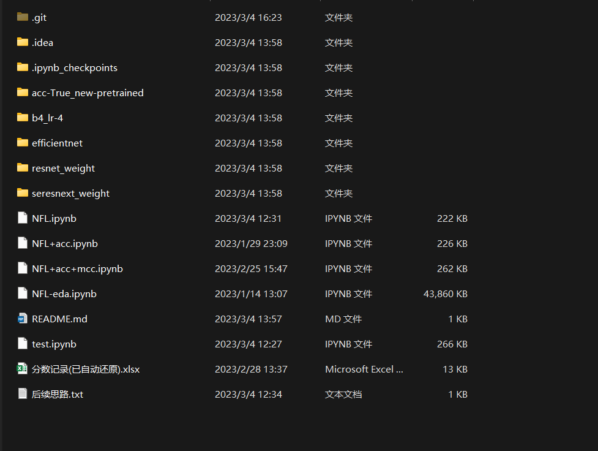
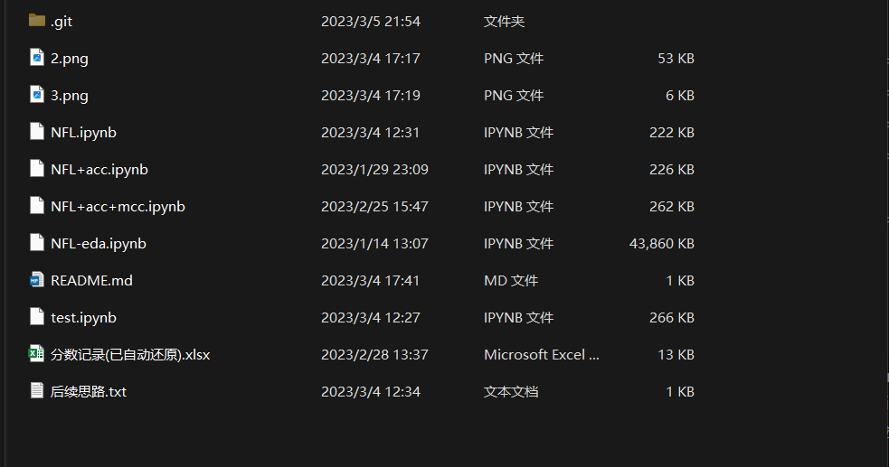
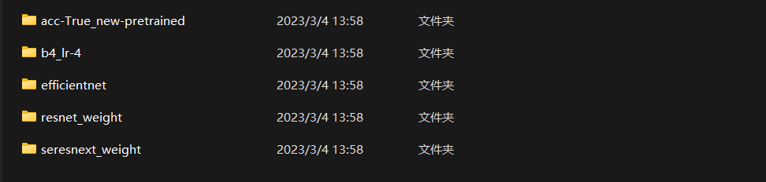
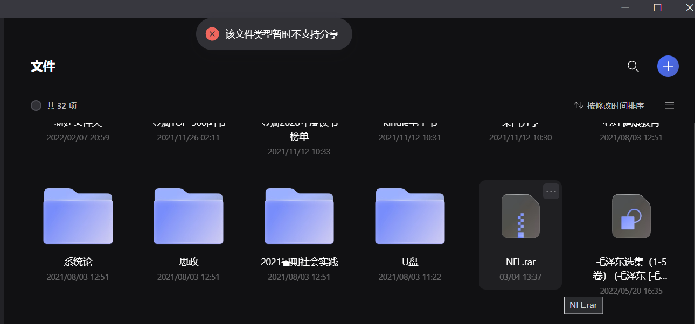

# NFL
## 结构

这是项目文件结构，其中第一个为git配置文件，.idea和.ipynb_checkpoints为jupyter检查点文件，其余文件里是训练权重，由于数量比较多无法上传到Github，故将其上传到了阿里云盘。剩余文件包括了不同版本的训练文件和改进思路，以及实验数据的记录。本次比赛的推理文件在kaggle上

由于github内存限制，故将本项目文件分成两个部分

所有的文件放到了NFL下

剩下的权重文件在NFL-weights里面

  2023/06/26更新

1、训练代码有3个版本，分别为最初的（根据val-loss选择）、加上acc（但是这个并没有改善太多，因为这这存在正负样本不均衡）、加mcc（mcc可以有效克服正负样本不均衡，但是。而且也是本次比赛的要求指标，但是我写的应该是有bug，几个月前测试过几次，无功而返）

2、上传权重文件

但是在上传阿里云盘时我是直接把整个文件目录放上去了，没有区分NFL文件和NFL-weights文件

绷

3、偶然想起以前看到的讨论，把损失函数替换成mcc

https://www.kaggle.com/competitions/nfl-player-contact-detection/discussion/370723